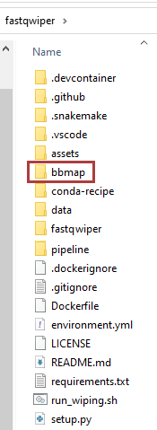

# FastqWiper 
[](https://github.com/mazzalab/fastqwiper/actions/workflows/buildall_and_publish.yml) [](https://codecov.io/gh/mazzalab/fastqwiper) [](https://github.com/mazzalab/fastqwiper/issues) 

[](https://anaconda.org/bfxcss/fastqwiper) [](https://anaconda.org/bfxcss/fastqwiper) [](https://anaconda.org/bfxcss/fastqwiper) [](https://anaconda.org/bfxcss/fastqwiper)

[](https://badge.fury.io/py/fastqwiper) [](https://pypi.python.org/pypi/fastqwiper/) 

[](https://hub.docker.com/r/mazzalab/fastqwiper) 

`FastqWiper` is a Snakemake-enabled application that wipes out bad reads from broken FASTQ files. Additionally, the available and pre-designed Snakemake [workflows](https://github.com/mazzalab/fastqwiper/tree/main/pipeline) allows **recovering** corrupted `fastq.gz`, **dropping** or **fixing** pesky lines, **removing** unpaired reads, and **fixing** reads interleaving.

* Compatibility: Python ≥3.7, <3.11
* OS: Windows, Linux, Mac OS (Snakemake workflows through Docker for Windows)
* Contributions: [bioinformatics@css-mendel.it](bioinformatics@css-mendel.it)
* Docker: https://hub.docker.com/r/mazzalab/fastqwiper
* Bug report: [https://github.com/mazzalab/fastqwiper/issues](https://github.com/mazzalab/fastqwiper/issues)


## USAGE
- **Case 1**. You have one or a couple (R1&R2) of **computer readable** FASTQ files which contain pesky, unformatted, uncompliant lines: Use *FastWiper* to clean them;
- **Case 2**. You have one or a couple (R1&R2) of **computer readable** FASTQ files that you want to drop unpaired reads from or fix reads interleaving: Use the FastqWiper's *Snakemake workflows*;
- **Case 3**. You have one `fastq.gz` file or a couple (R1&R2) of `fastq.gz` files which are corrupted and you want to recover healthy reads and reformat them: Use the FastqWiper's *Snakemake workflows*;


## Installation
### Case 1
This requires you to install FastqWiper and therefore does not require you to configure *workflows* also. You can do it for all OSs:

#### <u>Use Conda</u>

```
conda create -n fastqwiper python=3.10
conda activate fastqwiper
conda install -c bfxcss fastqwiper

fastqwiper --help
```
*Hint: for an healthier experience, use* **mamba**


#### <u>Use Pypi</u>
```
pip install fastqwiper

fastqwiper --help
```
<br/>

`fastqwiper  <options>`
```
options:
  --fastq_in TEXT          The input FASTQ file to be cleaned  [required]
  --fastq_out TEXT         The wiped FASTQ file                [required]
  --log_frequency INTEGER  The number of reads you want to print a status message
  --log_out TEXT           The file name of the final quality report summary
  --help                   Show this message and exit.
```
It  accepts in input and outputs **readable** `*.fastq` or `*.fastq.gz` files.


### Cases 2 & 3
There is a <b>QUICK</b> and a <b>SLOW</b> method to configure `FastqWiper`'s workflows.


#### <u>The quick way</u> (Docker, all OS)
1. Pull the Docker image from DockerHub:

`docker pull mazzalab/fastqwiper`

2. Once downloaded the image, type:

`docker run --rm -ti --name fastqwiper -v "YOUR_LOCAL_PATH_TO_DATA_FOLDER:/fastqwiper/data" mazzalab/fastqwiper paired 8 sample`

where:

- `YOUR_LOCAL_PATH_TO_DATA_FOLDER` is the path of the folder where the fastq.gz files to be wiped are located;
- `paired` triggers the cleaning of R1 and R2. Alternatively, `single` will trigger the wipe of individual FASTQ files;
- `8` is the number of your choice of computing cores to be spawned;
- `sample` is part of the names of the FASTQ files to be wiped. <b>Be aware</b> that: for <b>paired-end</b> files (e.g., "sample_R1.fastq.gz" and "sample_R2.fastq.gz"), your files must finish with `_R1.fastq.gz` and `_R2.fastq.gz`. Therefore, the argument to pass is everything <u>before</u> these texts: `sample` in this case. For <b>single end</b>/individual files (e.g., "excerpt_R1_001.fastq.gz"), your file must end with the string `.fastq.gz`; the preceding text, i.e., "excerpt_R1_001" in this case, will be the text to be passed to the command as an argument. E.g., 

`docker run --rm -ti --name fastqwiper -v "YOUR_LOCAL_PATH_TO_DATA_FOLDER:/fastqwiper/data" mazzalab/fastqwiper single 8 excerpt_R1_001`

#### <u>The slow way</u> (Linux & Mac OS)
To enable the use of preconfigured [pipelines](https://github.com/mazzalab/fastqwiper/tree/main/pipeline), you need to install **Snakemake**. The recommended way to install Snakemake is via Conda, because it enables **Snakemake** to [handle software dependencies of your workflow](https://snakemake.readthedocs.io/en/stable/snakefiles/deployment.html#integrated-package-management).
However, the default conda solver is slow and often hangs. Therefore, we recommend installing [Mamba](https://github.com/mamba-org/mamba) as a drop-in replacement via

`$ conda install -c conda-forge mamba`

if you have anaconda/miniconda already installed, or directly installing `Mambaforge` as described [here](https://github.com/conda-forge/miniforge#mambaforge).


Then, create and activate a clean environment as above:

```
mamba create -n fastqwiper python=3.10
mamba activate fastqwiper
```
Finally, install a few dependencies:

```
$ mamba install -c bioconda snakemake
$ mamba install colorama click
```


#### <u>Usage</u>
Clone the FastqWiper repository in a folder of your choice and enter it:

```
git clone https://github.com/mazzalab/fastqwiper.git
cd fastqwiper
```

It contains, in particular, a folder `data` containing the fastq files to be processed, a folder `pipeline` containing the released pipelines and a folder `fastq_wiper` with the source files of `FastqWiper`. <br/>
Input files to be processed should be copied into the **data** folder.

Currently, to run the `FastqWiper` pipelines, the following packages need to be installed manually:

### required packages:
[gzrt](https://github.com/arenn/gzrt) (Linux build fron source [instructions](https://github.com/arenn/gzrt/blob/master/README.build), Ubuntu install [instructions](https://howtoinstall.co/en/gzrt), Mac OS install [instructions](https://formulae.brew.sh/formula/gzrt))

[BBTools](https://jgi.doe.gov/data-and-tools/software-tools/bbtools/) (install [instructions](https://jgi.doe.gov/data-and-tools/software-tools/bbtools/bb-tools-user-guide/installation-guide/))

If installed from source, `gzrt` scripts need to be put on PATH. `bbmap` must be installed in the root folder of FastqWiper, as the image below



### Commands:
Copy the fastq files you want to fix in the `data` folder.
**N.b.**: In all commands above, you will pass to the workflow the name of the sample to be analyzed through the config argument: `sample_name`. Remember that your fastq files' names must finish with `_R1.fastq.gz` and `_R2.fastq.gz`, for paired fastq files, and with `.fastq.gz`, for individual fastq files, and, therefore, the text to be assigned to the variable `sample_name` must be everything <u>before</u> them. E.g., if your files are `my_sample_R1.fastq.gz` and `my_sample_R2.fastq.gz`, then `--config sample_name=my_sample`.

#### Paired-end files

- **Get a dry run** of a pipeline (e.g., `fix_wipe_single_reads_sequential.smk`):<br />
`snakemake --config sample_name=my_sample -s pipeline/fix_wipe_pairs_reads_sequential.smk --use-conda --cores 4`

- **Generate the planned DAG**:<br />
`snakemake --config sample_name=my_sample -s pipeline/fix_wipe_single_reads_sequential.smk --dag | dot -Tpdf > dag.pdf`<br />


- **Run the pipeline** (n.b., during the first execution, Snakemake will download and install some required remote packages and may take longer). The number of computing cores can be tuned accordingly:<br />
`snakemake --config sample_name=my_sample -s pipeline/fix_wipe_single_reads_sequential.smk --use-conda --cores 2`

Fixed files will be copied in the `data` folder and will be suffixed with the string `_fixed_wiped_paired_interleaving`.
We remind that the `fix_wipe_pairs_reads_sequential.smk` and `fix_wipe_pairs_reads_parallel.smk` pipelines perform the following actions:
- execute `gzrt` on corrupted fastq.gz files (i.e., that cannot be unzipped because of errors) and recover readable reads;
- execute `fastqwiper` on recovered reads to make them compliant with the FASTQ format (source: [Wipipedia](https://en.wikipedia.org/wiki/FASTQ_format))
- execute `Trimmomatic` on wiped reads to remove residual unpaired reads
- execute `BBmap (repair.sh)` on paired reads to fix the correct interleaving and sort fastq files.  

#### Single-end files
`fix_wipe_single_reads_parallel.smk` and `fix_wipe_single_reads_sequential.smk` will not execute `trimmomatic` and BBmap's `repair.sh`.

- **Get a dry run** of a pipeline (e.g., `fix_wipe_single_reads_sequential.smk`):<br />
`snakemake --config sample_name=my_sample -s pipeline/fix_wipe_single_reads_sequential.smk --use-conda --cores 2 -np`

- **Generate the planned DAG**:<br />
`snakemake --config sample_name=my_sample -s pipeline/fix_wipe_single_reads_sequential.smk --dag | dot -Tpdf > dag.pdf`<br />


- **Run the pipeline** (n.b., The number of computing cores can be tuned accordingly):<br />
`snakemake --config sample_name=my_sample -s pipeline/fix_wipe_single_reads_sequential.smk --use-conda --cores 2`

# Author
**Tommaso Mazza**  
[](https://twitter.com/irongraft)

Laboratory of Bioinformatics</br>
Fondazione IRCCS Casa Sollievo della Sofferenza</br>
Viale Regina Margherita 261 - 00198 Roma IT</br>
Tel: +39 06 44160526 - Fax: +39 06 44160548</br>
E-mail: t.mazza@css-mendel.it</br>
Web page: http://www.css-mendel.it</br>
Web page: http://bioinformatics.css-mendel.it</br>
